# AI Native Shopper CRM System Architecture

## 1. Architecture Overview

The platform should be built as a modular monolith backend with a logically separate Channel Simulator Service.

For a 4-day startup build, this gives the best balance of speed, clarity, and future scalability.

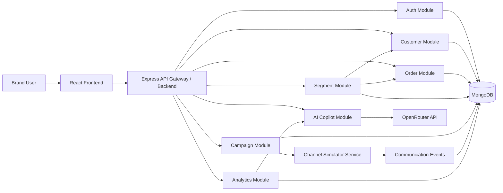

## 2. Recommended Architecture

Use a modular monolith for the core CRM:

- One Express backend app
- Separate modules by business domain
- Shared MongoDB database
- Clear internal service boundaries
- One separately runnable Channel Simulator service or module

### Why Modular Monolith?

The product must be built quickly. A microservice architecture would add unnecessary complexity:

- Service discovery
- Distributed tracing
- Multiple deployments
- Cross-service authentication
- Event infrastructure
- Operational overhead

For MVP, the better approach is:

> Build like a monolith, structure like services.

Each module should have its own:

- Routes
- Controller
- Service layer
- Model
- Validation
- Business logic

Suggested backend structure:

```txt
backend/
  src/
    modules/
      auth/
      customers/
      orders/
      segments/
      campaigns/
      channelSimulator/
      communicationEvents/
      analytics/
      aiCopilot/
    config/
    middleware/
    utils/
    app.js
    server.js
```

## 3. Service Boundaries

### Authentication Service

**Responsibilities**

- Register user
- Login user
- Hash passwords
- Issue JWT
- Protect routes
- Attach authenticated user to request

**Owns**

- User model
- Auth middleware
- Token generation

**Does Not Own**

- Customer data
- Campaign permissions beyond basic user identity

### Customer Service

**Responsibilities**

- Create, read, update, and delete customers
- Search and filter customers
- Store shopper identity and profile data
- Maintain computed fields like total spend and order count

**Owns**

- Customer model
- Customer profile APIs

**Consumed By**

- Segments
- Campaigns
- Analytics
- AI Copilot

### Order Service

**Responsibilities**

- Store customer orders
- Link orders to customers
- Calculate order-driven metrics
- Update customer aggregates after order creation

**Owns**

- Order model
- Order APIs

**Consumed By**

- Segments
- Analytics
- AI Copilot

### Segment Service

**Responsibilities**

- Create audience segments
- Store segment rules
- Evaluate customers against rules
- Preview matching audience
- Return audience for campaign execution

**Owns**

- Segment model
- Rule evaluation engine

**Consumes**

- Customer data
- Order/customer aggregate data

### Campaign Service

**Responsibilities**

- Create campaigns
- Store AI-generated campaign copy
- Attach campaign to segment
- Manage campaign status
- Trigger campaign simulation
- Track campaign lifecycle

**Owns**

- Campaign model
- Campaign state transitions

**Consumes**

- Segment Service
- Channel Simulator
- Communication Events

### Channel Simulator Service

**Responsibilities**

- Simulate outbound communication
- Generate delivery, open, click, conversion, and failure events
- Pretend to behave like Email, SMS, WhatsApp, or Push providers
- Optionally simulate failures

**Owns**

- Channel simulation logic
- Event generation rules

**Produces**

- Communication events

For MVP, this can live inside the same backend codebase but should be isolated as if it could become a separate service later.

### Communication Event Service

**Responsibilities**

- Store communication events
- Track event status per customer and campaign
- Provide event timeline
- Feed analytics calculations

**Owns**

- CommunicationEvent model

**Event Types**

- Sent
- Delivered
- Opened
- Clicked
- Failed
- Converted

### Analytics Service

**Responsibilities**

- Aggregate campaign performance
- Calculate funnel metrics
- Calculate rates
- Provide dashboard summaries
- Feed AI Copilot with structured performance context

**Owns**

- Analytics queries
- Aggregation logic

**Consumes**

- Customers
- Orders
- Campaigns
- Communication Events

### AI Copilot Service

**Responsibilities**

- Generate campaign content
- Generate recommendations
- Explain performance
- Suggest segments
- Prepare prompts for OpenRouter
- Normalize AI responses

**Owns**

- Prompt templates
- OpenRouter integration
- AI response parsing

**Consumes**

- Customer summaries
- Order summaries
- Campaign summaries
- Segment summaries
- Analytics summaries

## 4. Request Flow

### Generic API Request Flow

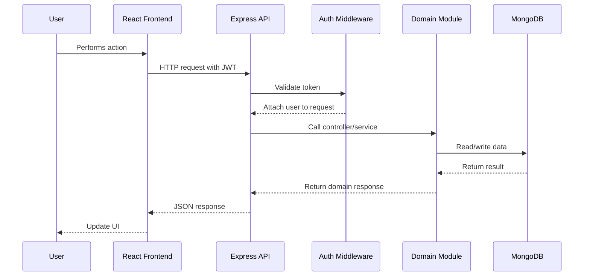

### Example: Create Customer

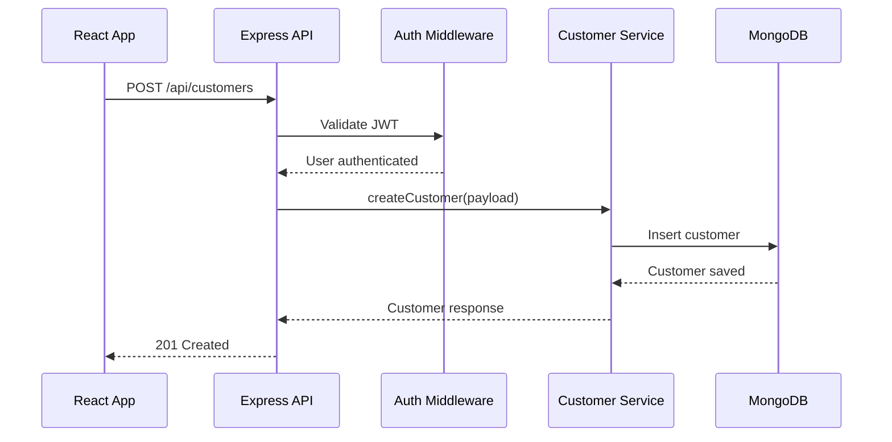

## 5. Communication Flow

For MVP, use mostly synchronous HTTP between frontend and backend.

Inside backend modules, use direct service calls.

For simulated channel events, use either:

- Direct service call for immediate simulation
- Lightweight async job abstraction for future scaling

MVP path:

```txt
Frontend -> Express API -> Campaign Service -> Channel Simulator -> Communication Event Service -> MongoDB
```

Future scalable path:

```txt
Campaign Service -> Queue -> Channel Worker -> Event Processor -> Analytics Store
```

### Communication Diagram

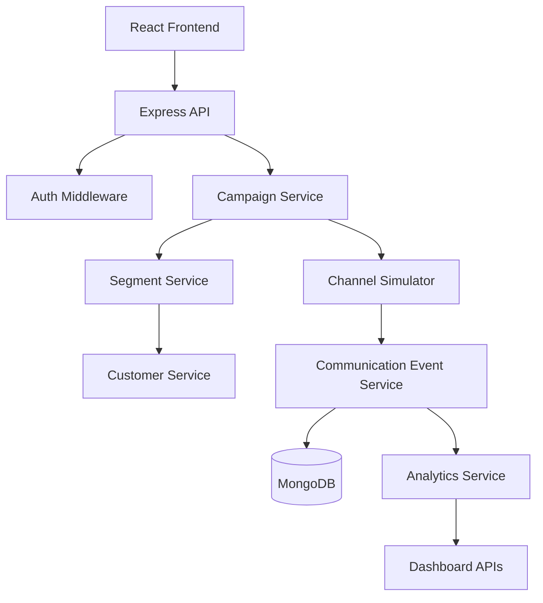

## 6. Campaign Execution Flow

Campaign execution is the core business flow.

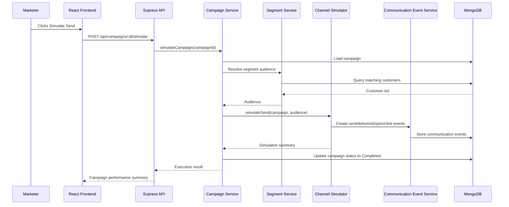

### Campaign Status Lifecycle

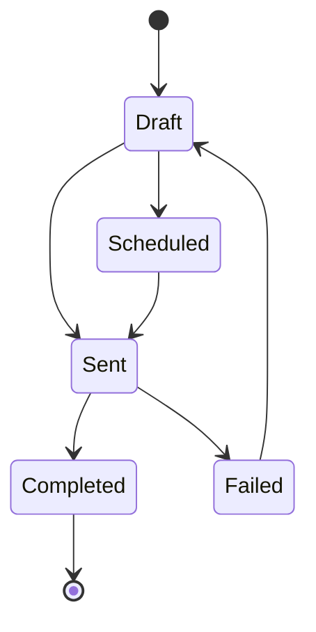

### Campaign Execution Steps

1. User selects campaign
2. Backend loads campaign
3. Segment service resolves audience
4. Channel simulator creates mock delivery behavior
5. Communication events are stored
6. Campaign status is updated
7. Analytics become available

## 7. Callback Processing Flow

In the MVP, callbacks are simulated. The architecture should still mirror real provider callbacks.

Real providers like WhatsApp, Twilio, SendGrid, or Firebase would send webhooks when delivery, open, or click events happen.

### MVP Simulated Callback Flow

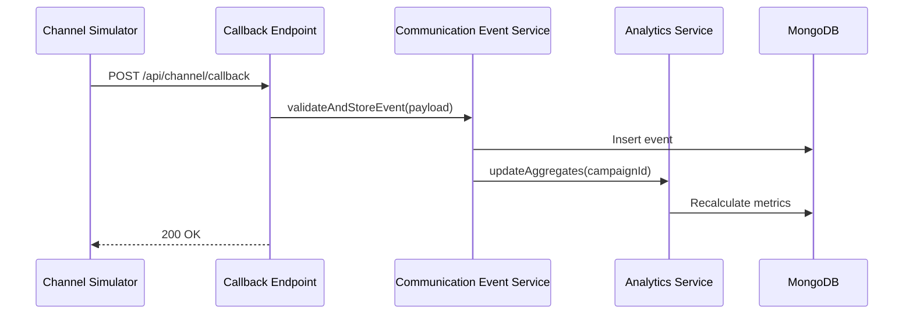

### Future Real Callback Flow

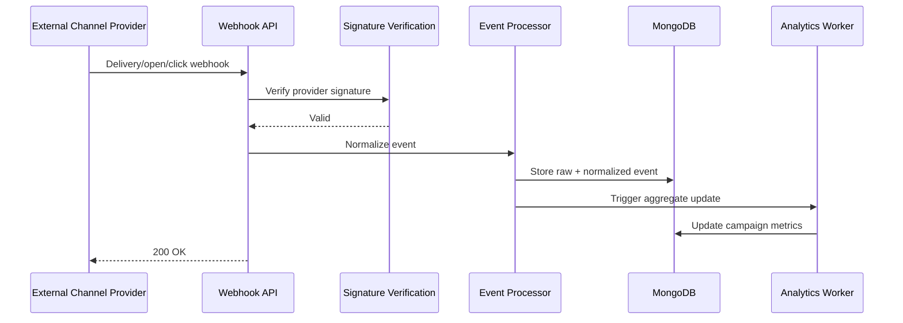

Callback endpoint:

```txt
POST /api/channel/callback
```

Payload:

```js
{
  campaignId,
  customerId,
  channel,
  eventType,
  providerMessageId,
  timestamp,
  metadata
}
```

## 8. Analytics Processing Flow

For MVP, analytics can be computed on demand using MongoDB aggregation.

At higher scale, analytics should move to precomputed aggregates.

### MVP Analytics Flow

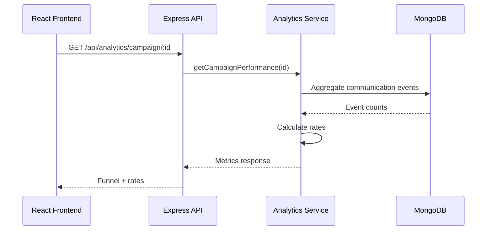

### Metrics Calculated

```txt
sentCount
deliveredCount
openCount
clickCount
conversionCount
failedCount
deliveryRate
openRate
clickRate
conversionRate
```

### Analytics Design

For MVP:

- Query events directly
- Aggregate per request
- Use MongoDB indexes on campaignId, customerId, eventType, and createdAt

For scale:

- Store campaign-level aggregates
- Update aggregates asynchronously
- Use event processing workers
- Add time-series analytics store if needed

## 9. AI Workflow

The AI Copilot should act as an orchestration layer around OpenRouter.

It should not expose raw CRM data blindly. It should summarize structured data first.

### AI Campaign Generation Flow

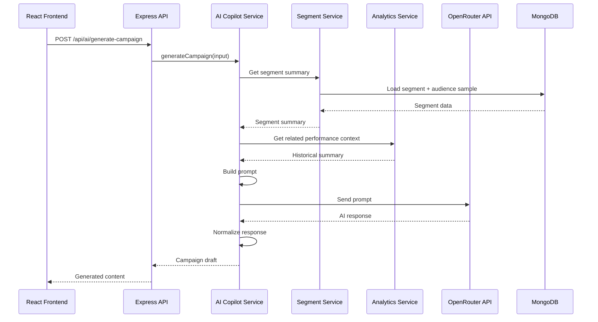

### AI Recommendations Flow

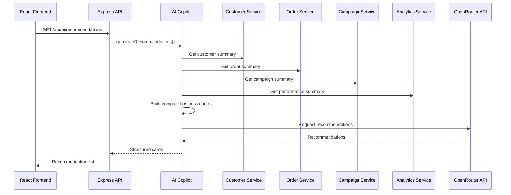

### AI Responsibilities

AI Copilot should:

- Build safe prompts
- Keep responses structured
- Validate JSON output
- Retry or fallback when AI response is malformed
- Store generated campaign drafts only after user confirmation
- Avoid using AI for deterministic business logic

## 10. Component Breakdown

### Frontend Components

```txt
src/
  context/
    AuthContext.jsx
    AppContext.jsx

  api/
    client.js
    authApi.js
    customerApi.js
    orderApi.js
    segmentApi.js
    campaignApi.js
    analyticsApi.js
    aiApi.js

  pages/
    Login.jsx
    Register.jsx
    Dashboard.jsx
    Customers.jsx
    CustomerDetail.jsx
    Orders.jsx
    Segments.jsx
    SegmentBuilder.jsx
    Campaigns.jsx
    CampaignCreate.jsx
    CampaignDetail.jsx
    Performance.jsx
    AIInsights.jsx
    Settings.jsx

  components/
    layout/
      Sidebar.jsx
      Topbar.jsx
      ProtectedRoute.jsx

    customers/
      CustomerTable.jsx
      CustomerForm.jsx

    segments/
      SegmentRuleBuilder.jsx
      SegmentPreview.jsx

    campaigns/
      CampaignForm.jsx
      CampaignMessagePreview.jsx
      ChannelSelector.jsx

    analytics/
      FunnelChart.jsx
      MetricCard.jsx

    ai/
      RecommendationCard.jsx
      AIGeneratedCopy.jsx
```

### Backend Components

```txt
src/
  modules/
    auth/
      auth.routes.js
      auth.controller.js
      auth.service.js
      user.model.js

    customers/
      customer.routes.js
      customer.controller.js
      customer.service.js
      customer.model.js

    orders/
      order.routes.js
      order.controller.js
      order.service.js
      order.model.js

    segments/
      segment.routes.js
      segment.controller.js
      segment.service.js
      segment.model.js
      ruleEvaluator.js

    campaigns/
      campaign.routes.js
      campaign.controller.js
      campaign.service.js
      campaign.model.js

    channelSimulator/
      channel.routes.js
      channel.controller.js
      channelSimulator.service.js

    communicationEvents/
      communicationEvent.model.js
      communicationEvent.service.js

    analytics/
      analytics.routes.js
      analytics.controller.js
      analytics.service.js

    aiCopilot/
      ai.routes.js
      ai.controller.js
      ai.service.js
      promptBuilder.js
      openRouterClient.js
```

## 11. Service Responsibilities

| Service | Main Responsibility | Owns Data? | Depends On |
| --- | --- | --- | --- |
| Auth | Identity and JWT auth | Yes | MongoDB |
| Customer | Shopper profiles | Yes | MongoDB |
| Order | Transaction history | Yes | Customer, MongoDB |
| Segment | Audience rules and evaluation | Yes | Customer, Order |
| Campaign | Campaign lifecycle | Yes | Segment, Channel |
| Channel Simulator | Fake message delivery | No / Events only | Campaign, Events |
| Communication Events | Event tracking | Yes | MongoDB |
| Analytics | Metrics and summaries | Derived | Events, Campaigns |
| AI Copilot | AI generation and recommendations | Optional logs | OpenRouter, Analytics |

## 12. Database Design

### Collections

```txt
users
customers
orders
segments
campaigns
communication_events
```

### Key Indexes

```js
// customers
{ email: 1 }
{ phone: 1 }
{ city: 1 }
{ totalSpend: -1 }
{ orderCount: -1 }
{ lastOrderDate: -1 }

// orders
{ customerId: 1 }
{ orderDate: -1 }
{ status: 1 }

// segments
{ createdBy: 1 }
{ createdAt: -1 }

// campaigns
{ segmentId: 1 }
{ status: 1 }
{ createdAt: -1 }

// communication_events
{ campaignId: 1 }
{ customerId: 1 }
{ campaignId: 1, eventType: 1 }
{ campaignId: 1, customerId: 1 }
{ timestamp: -1 }
```

## 13. Core API Surface

### Auth

```txt
POST /api/auth/register
POST /api/auth/login
GET  /api/auth/me
```

### Customers

```txt
GET    /api/customers
POST   /api/customers
GET    /api/customers/:id
PUT    /api/customers/:id
DELETE /api/customers/:id
```

### Orders

```txt
GET    /api/orders
POST   /api/orders
GET    /api/orders/:id
PUT    /api/orders/:id
DELETE /api/orders/:id
```

### Segments

```txt
GET    /api/segments
POST   /api/segments
POST   /api/segments/preview
GET    /api/segments/:id
PUT    /api/segments/:id
DELETE /api/segments/:id
```

### Campaigns

```txt
GET  /api/campaigns
POST /api/campaigns
GET  /api/campaigns/:id
PUT  /api/campaigns/:id
POST /api/campaigns/:id/simulate
```

### Analytics

```txt
GET /api/analytics/dashboard
GET /api/analytics/campaigns/:id
GET /api/analytics/campaigns/:id/events
```

### AI

```txt
POST /api/ai/generate-campaign
GET  /api/ai/recommendations
POST /api/ai/analyze-performance
POST /api/ai/suggest-segments
```

## 14. Why This Architecture?

### It Optimizes for Speed

The MVP needs to be built in days, not months. A modular monolith avoids distributed system overhead while keeping code organized.

### It Matches the Product Domain

CRM data, orders, segments, campaigns, and analytics are tightly connected. Keeping them close reduces accidental complexity.

### It Keeps AI as a Product Layer

AI is not spread randomly across the app. The AI Copilot is its own service boundary that consumes structured context from other modules.

### It Allows Future Extraction

The Channel Simulator and Analytics modules can later become standalone services without rewriting the whole product.

## 15. How It Scales

### MVP Scale

At MVP scale:

- React frontend
- Single Express backend
- Single MongoDB database
- On-demand analytics aggregation
- Synchronous channel simulation

This is enough for demo usage and early customers.

### Early Production Scale

Add:

- MongoDB indexes
- Pagination
- Rate limiting
- Request validation
- Background jobs
- Cached dashboard metrics
- Async campaign execution
- Separate worker process

### Later Scale

Move from:

```txt
API directly simulates campaign
```

To:

```txt
API creates campaign job
Worker processes campaign
Events are written async
Analytics aggregates update async
```

Recommended additions:

- Redis/BullMQ for jobs
- Event queue
- Dedicated workers
- Webhook processor
- Aggregate analytics collections
- Object storage for imports/exports
- Observability stack

## 16. What Changes at 1M Users?

At 1M users, the architecture should evolve.

### Backend

Split the modular monolith selectively:

1. Auth service
2. Campaign execution service
3. Channel delivery service
4. Analytics service
5. AI orchestration service

Do not split everything blindly. Extract only high-load modules.

### Database

MongoDB changes:

- Add sharding strategy
- Separate operational and analytics workloads
- Use read replicas
- Add aggregate collections
- Archive old events
- Consider ClickHouse or BigQuery for analytics

### Campaign Execution

Move campaign execution fully async:

```txt
Campaign API -> Queue -> Campaign Worker -> Channel Worker -> Event Processor -> Analytics Worker
```

### Analytics

At 1M users, do not calculate campaign metrics from raw events on every request.

Use:

- Precomputed campaign aggregates
- Time-windowed rollups
- Event stream processing
- Dedicated analytics database

### AI

AI must become cost-aware and latency-aware:

- Cache AI recommendations
- Use prompt compression
- Summarize data before AI calls
- Run batch recommendations asynchronously
- Add tenant-level rate limits
- Track AI cost per workspace

### Infrastructure

Add:

- Load balancer
- Horizontal API scaling
- Worker autoscaling
- Queue monitoring
- Central logging
- Distributed tracing
- Secret management
- CI/CD
- Staging and production environments

## 17. Tradeoffs

### Tradeoff 1: Modular Monolith vs Microservices

**Choice:** Modular monolith.

**Benefit:**

- Faster to build
- Easier to debug
- Easier local development
- Lower infrastructure burden

**Cost:**

- Less independent scaling
- Requires discipline to preserve boundaries

### Tradeoff 2: MongoDB Aggregations vs Analytics Database

**Choice:** MongoDB for MVP analytics.

**Benefit:**

- Simple stack
- Fast implementation
- No extra infrastructure

**Cost:**

- Expensive for large-scale event analytics
- Harder to support advanced reporting later

### Tradeoff 3: Channel Simulation vs Real Integrations

**Choice:** Simulated channels.

**Benefit:**

- Proves product loop quickly
- No external provider setup
- Demo-friendly

**Cost:**

- Not production delivery-ready
- No real deliverability constraints

### Tradeoff 4: Synchronous Execution vs Async Workers

**Choice:** Mostly synchronous for MVP.

**Benefit:**

- Easier to implement
- Easier to reason about
- Fewer moving parts

**Cost:**

- Campaign execution can block requests
- Not suitable for large audiences

### Tradeoff 5: AI Copilot as API Layer vs Autonomous Agent

**Choice:** AI as controlled service.

**Benefit:**

- Predictable
- Easier to validate
- Safer for business workflows

**Cost:**

- Less autonomous than fully agentic workflows
- Requires users to confirm actions

## 18. Final Recommended System Shape

For the 4-day build:

```txt
React Frontend
  -> Express Modular Monolith
    -> Auth Module
    -> Customer Module
    -> Order Module
    -> Segment Module
    -> Campaign Module
    -> Channel Simulator Module
    -> Communication Event Module
    -> Analytics Module
    -> AI Copilot Module
  -> MongoDB
  -> OpenRouter
```

The core product loop should remain:

```txt
Customer Data
  -> Segments
  -> AI Campaign
  -> Simulated Send
  -> Communication Events
  -> Analytics
  -> AI Recommendations
```

This architecture is fast enough for an MVP, clean enough to maintain, and structured enough to evolve into a distributed system when real usage demands it.
